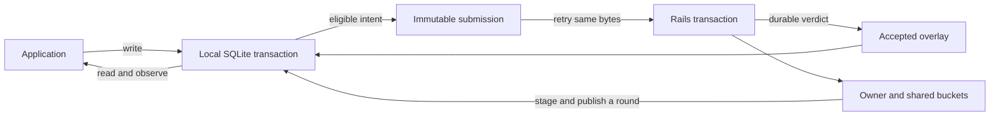

# Keynotes

ReplicaMan gives each account a durable local copy of the data it owns in a Rails application. This guide explains how local edits, server decisions, and shared document history fit together. API examples live in the individual guides.

## 1. Two kinds of data

**Row streams** carry field patches. Editing a title changes the title field; another device can change a different field independently. Competing values for one field follow server transaction order unless business rules intervene.

**Document streams** carry mergeable history through a codec such as Loro. The document owns its content; reflected row columns make that content convenient to list, filter, and display. A row projection cannot independently overwrite a document-owned field.

Both use the same authorization, operation ids, pull rounds, and account boundaries.

## 2. Local saving comes first

An application write updates SQLite and records what the server is owed in the same transaction. Reads see the local result immediately. A restart finds both the saved value and its pending work.

There are three useful milestones:

| Milestone | Meaning |
| --- | --- |
| Saved locally | The local transaction committed |
| Accepted by the server | Rails committed the domain result and the client saved its verdict |
| Pulled | A published pull round includes that accepted work |

Keeping these milestones separate prevents a slow or lost response from being mistaken for a failed local save.

## 3. Editable intent becomes an immutable submission

Pending local intent can change while it is held by an application gate. When it becomes eligible, ReplicaMan freezes its bytes and gives every operation its own id.

Retries keep those bytes and those ids. The server remembers every operation id with its verdict: a retry returns the recorded verdict without running the domain action again. A timeout after server commit therefore does not run the action a second time.

Later edits become later work. They cannot mutate a submission already sent over the network.

## 4. Server decisions are durable

Rails commits the domain change, its capture and the operation's verdict together. A declared domain refusal rolls back that action and records its refusal. An infrastructure failure rolls back the whole request, and the client retries the same operations.

The client validates the complete reply before changing local delivery state: a missing, duplicate or foreign verdict acknowledges nothing.

External work belongs in a job enqueued inside the same transaction, on a queue stored in the same database. Database replay protection does not make an arbitrary network call transactional.

## 5. Buckets and pull rounds

Every synchronized row lives in one bucket: its owner's, or a shard's shared bucket for rows every account reads. A row stays in the bucket it was born in; its owner never changes. Each bucket counts its changes in commit order.

A client pulls its buckets with a cursor it keeps; the server keeps no per-device state. Pages go into staging, which application reads never see. When the last page of a round arrives, one SQLite transaction publishes the round, rebases local work, and advances the cursor. An interrupted round resumes from its staging; the previous published state stays intact meanwhile. Publication is atomic per shard, so streams that must be read consistently together share a shard.

## 6. Accepted work stays visible

A round may have started before a just-accepted write. The client therefore keeps accepted work in an overlay until a round that started after its acceptance publishes.

This prevents a late pull from temporarily erasing an accepted create or edit. Remaining local intent is rebased over each published round.

## 7. Identity has several scopes

| Identity | What it separates |
| --- | --- |
| Namespace | Replication applications |
| Schema version | Supported data contracts |
| Principal | Authenticated accounts |
| Dataset epoch | Histories before and after restore/fork |
| Operation id | One frozen operation and its verdict |
| Entity incarnation | Different lifetimes that reuse a business ID |

An old child edit names its original parent incarnation. Deleting and recreating the parent does not silently attach that edit to a new object. Similarly, a restored server rotates its dataset epoch before admitting clients, so old mutations cannot replay into a different history.

## 8. Deletion ends a lifetime

Deleting an entity ends its lifetime; a recreation is a new incarnation that names the one it replaces. Pending work that no longer belongs to the current lifetime becomes retained recovery data. It is not automatically replayed into a replacement entity or discarded as irrelevant.

## 9. Recovery preserves evidence

Refusals, holds, uncertain submissions, and archived branches are distinct states. The store exposes them through status and recovery APIs. Recovery exports preserve raw bytes and checksums, including values that cannot currently be decoded.

Document corruption does not trigger blank-document replacement. Resetting or rebuilding is explicit and archives the outgoing state first. Exporting a branch does not delete it.

## 10. Data flow

The application owns credentials, domain rules, scheduling, media storage, and presentation. ReplicaMan owns the storage and synchronization transitions between them.

## Next steps

- [Setup](./SETUP.md) — construct a client.
- [Mutations](./MUTATIONS.md) — choose local or remote atomicity.
- [Synchronization](./SYNC.md) — schedule delivery and inspect its stages.
- [Protocol specification](./PROTOCOL.md) — detailed invariants, wire limits, and failure behavior.
